# RoboWalker2022视觉组第0次作业：Git基础
出题人：李喆昊（QQ：1003449832）

Git是世界上使用最为广泛的代码版本控制工具，可以帮助我们提高个人工作以及与他人协作的效率。


## 目标
在本次作业中，你将学习到：

1. [什么是版本控制](#jump1)
   
2. [什么是Git](#jump2)

3. [在实践中学习Git](#jump3) 
   1. [初始化一个Git仓库](#jump31) 
   2. [暂存与提交文件](#jump32) 
   3. [回退到上一次提交](#jump33) 
   4. [使用.gitignore忽略不需要的文件](#jump34) 
   5. [从远端代码仓库(Github、Gitee)上拷贝代码](#jump35) 
   6. [什么是分支](#jump36) 
   7. [如何合作 & 什么是pull request](#jump37)
 
4. [相关学习资源推荐](#jump4)

下面让我们开始吧！👇 


### <span id="jump1">1. 什么是版本控制</span>

文件的版本，就是在提交/发布/关键节点时，文件内容所处的状态。比如APP的版本。

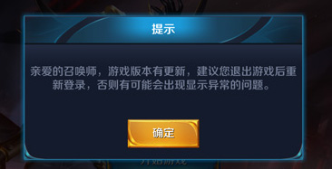

而当一个文件在提交/发布后仍然可能被多次修改，就会出现多个不同的版本，如下图所示。

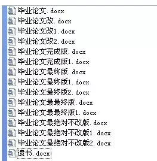

如何更有效地管理这些不同的版本，例如发布下一个版本、出现问题时回退到上一个版本、比较不同版本之间的差异、合并两个版本等等，就叫做**版本控制**。


**推荐的阅读资料：**
1. [Git简介](https://www.liaoxuefeng.com/wiki/896043488029600/896067008724000)
2.  [Git官方文档：起步 - 关于版本控制](https://git-scm.com/book/zh/v2/%E8%B5%B7%E6%AD%A5-%E5%85%B3%E4%BA%8E%E7%89%88%E6%9C%AC%E6%8E%A7%E5%88%B6)


### <span id="jump2">2. 什么是Git</span>


Git是世界上使用最为广泛的代码版本控制工具。

使用Git可以让我们：
1. 方便地保存工作的关键点，后续出错也能回到之前的状态

2. 方便地分享自己的工作或者合并他人的工作
3. 把代码上传到远端代码仓库，如github.com，不用担心本地代码丢失
4. 比较不同版本的文件，进行调试与问题修复
5. 更多没有列举的好处等待你探索

Git通过使用数据库记录文件快照（对当前的文件“拍照”）的方式进行版本控制，对具体细节感兴趣请阅读[官方教程：Git 是什么](https://git-scm.com/book/zh/v2/%E8%B5%B7%E6%AD%A5-Git-%E6%98%AF%E4%BB%80%E4%B9%88%EF%BC%9F)。

让我们先了解一下如何使用Git，之后再研究原理细节。

首先请安装Git。如何安装？请阅读[安装Git](https://www.liaoxuefeng.com/wiki/896043488029600/896067074338496)

**推荐的阅读资料：**
1. [官方教程：Git简史：（关于Linux之父不能继续白嫖别人的版本控制工具于是一气之下自己写了Git这件事-这个标题是我加的）](https://git-scm.com/book/zh/v2/%E8%B5%B7%E6%AD%A5-Git-%E7%AE%80%E5%8F%B2)
2. [Bitbucket tutorial: What is Git](https://www.atlassian.com/git/tutorials/what-is-git)
   
### <span id="jump3">3. 在实践中学习Git</span>

为了让大家轻松上手Git，我们将使用VSCode在实践中学习Git。Vscode中已经内置了Git功能。
按钮如下。

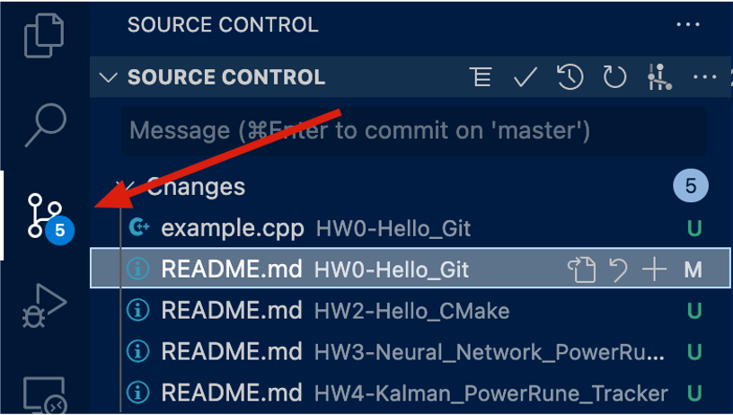

**进阶阅读资料**

1. [（英文官方文档）Using Version Control in VS Code](https://code.visualstudio.com/docs/editor/versioncontrol)

### <span id="jump31">3.1 初始化一个Git仓库</span>

首先，我们需要创建一个Git仓库。Git仓库是一个保存了文件修改等信息的数据库。

请在作业文件夹之外创建一个新文件夹，命名随意，如``git_test``, 并使用vscode打开。点击Git按钮，你会看到：

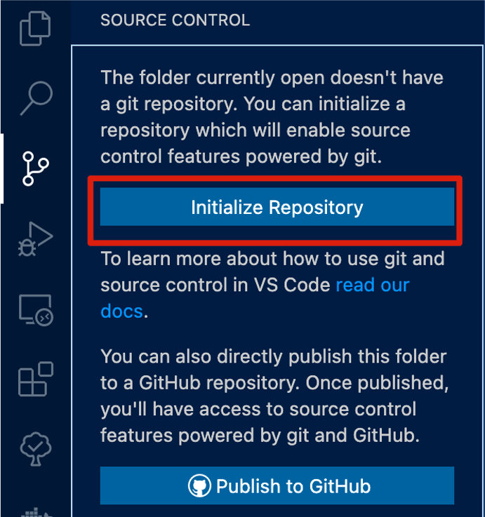

创建完毕后，界面如下：

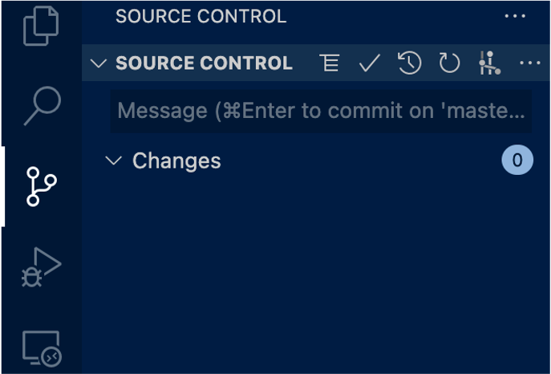

该文件夹下的Git仓库已经创建好了。（在该文件夹下会出现一个.git文件夹，这就是本地的git仓库所在位置，里面存储了很多文件的“元信息”）

在命令行中，对应的指令是``git init``。


###  <span id="jump32">3.2 暂存与提交文件</span>

在你的``git_test``文件夹下新建``main.cpp``，内容如下：
```c++
#include <iostream>
int main(){
    std::cout << "Hello World from C++!" << std::endl; 
}
```

此时，VSCode的Git界面如下：
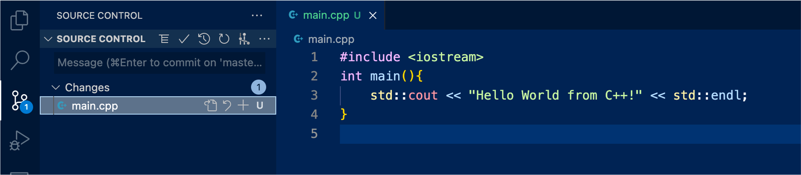

点击+号（其他按钮也请探索一下），将文件“暂存”（什么意思下文会介绍）。

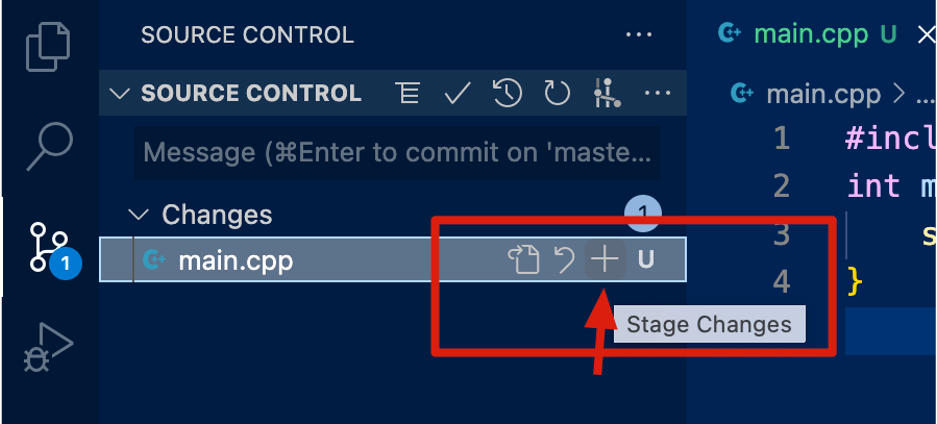

结果如下：


我们可以看到这时候``main.cpp``进入了"暂存区"(staged changes)，表示我们将其**标记**为：**希望在数据库中记录对该文件的修改。**

然后我们尝试“提交”（commit）对文件的修改，也就是将被标记为“暂存”的文件的修改记录都**保存入**本地Git数据库。

在下图红色框处输入“First commit”(其他内容也行，这是提交时需要提供的文字，用于自定义说明提交的内容/目的等，不能为空)，然后点击箭头所指按钮，完成提交。

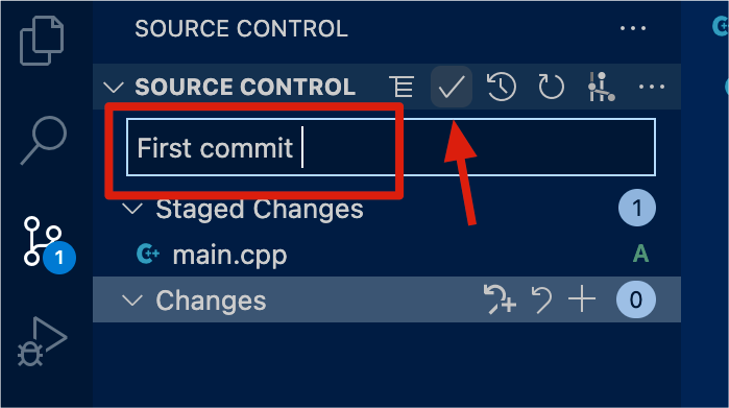

提交后的结果如下。我们可以在commit一栏看到历史提交。

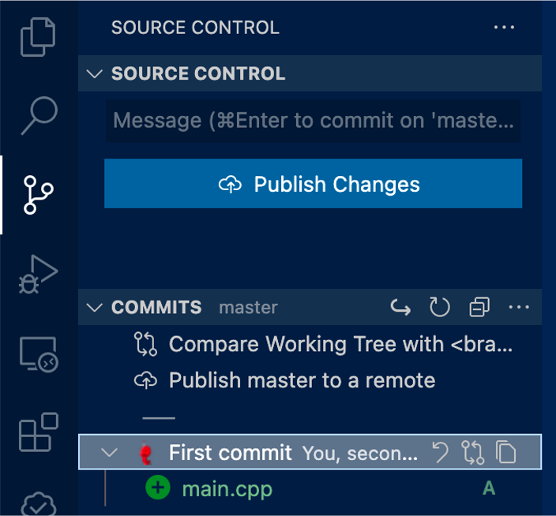

恭喜你！你完成了一次Git的暂存与提交！🎉

每一次Git提交都是你的工作的“关键点”，之后可以使用Git随时回退到这些关键点。我们马上会在下一节中介绍。

**推荐的阅读材料**
1. [工作区与暂存区](https://www.liaoxuefeng.com/wiki/896043488029600/897271968352576)
###  <span id="jump33">3.3 回退到上一次提交</span>

修改``main.cpp``，加入新的一行如下：
```c++
#include <iostream>
int main(){
    std::cout << "Hello World from C++!" << std::endl; 
    std::cout << "Hello Git!" << std::endl; 
}
```

可以看到新的修改又出现在了Git界面中。

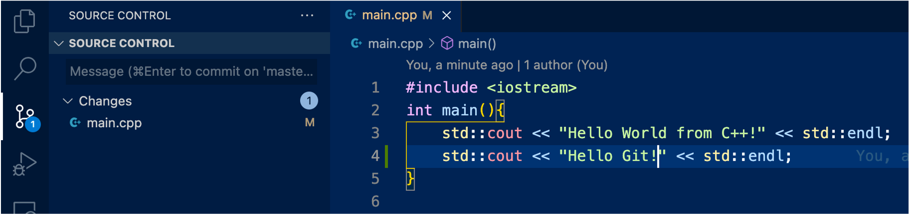

VSCode会用绿色的边框标识出增加的部分。（蓝色标识修改的部分，红色箭头是删除的部分）可以点击查看，如下：

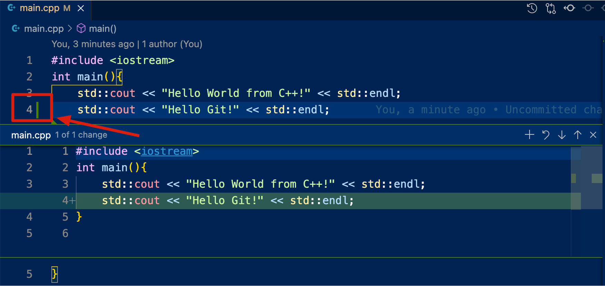

我们和上一节一样将``main.cpp``加入暂存区，然后创建新的提交，提交信息如“My second commit. Add another cout. ”

结果如下:

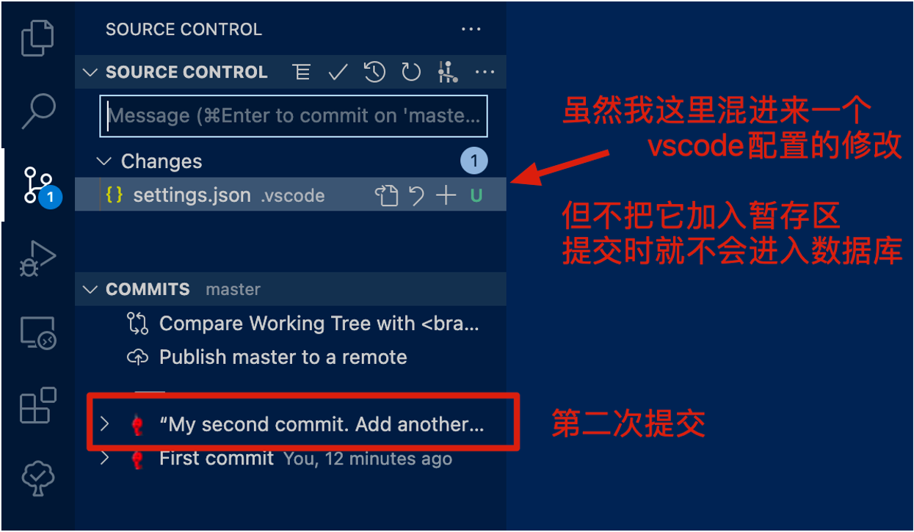

现在，如果我们想回退到第一次提交时的状态，但不抹去第二次提交：


铛铛！我们又回到了之前的状态。

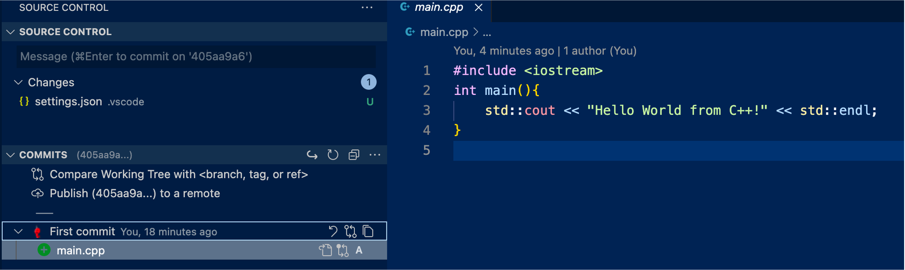

这时候commit记录中看不到第二次提交了，也许你会问：如何重新回到第二次提交的状态？

如下操作即可。


点击：

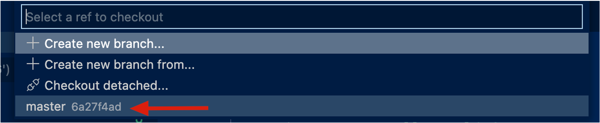

然后我们重新回到了第二次提交的状态。


**其中涉及到的概念：**
1. **Git的HEAD指针**：Git的commit记录可以看作一个链表，在不同提交之间切换的过程是Git内部的一个叫做HEAD的指针的移动。
2. **git checkout**：指切换到特定的commit记录。
3. **master**：是我们当前的“分支”名（第6节介绍），可以看成是一个叫做master的指针指向当前链表的最新提交。因此checkout到master指向的记录，也就是回到了第二次提交。

**推荐的阅读资料**
1. 可以自行Google搜索更多的git命令、探索vscode的功能。如
   

###  <span id="jump34">3.4 使用.gitignore忽略不需要的文件</span>

当我们不希望某些文件被git记录时，可以在git仓库所在目录（在.git外，与.git同级）下新建一个``.gitignore``文件，在其中加入我们想忽略的文件后缀与文件夹。


###  <span id="jump35">3.5 从远端代码仓库(Github、Gitee)上拷贝代码</span>

我们可以使用``git clone``功能去克隆公共代码仓库的代码。

强烈建议大家通过``git clone``的方式克隆本作业代码仓库。好处是之后我们作业仓库更新时，你可以通过``git pull``命令一键更新本地的作业题目。

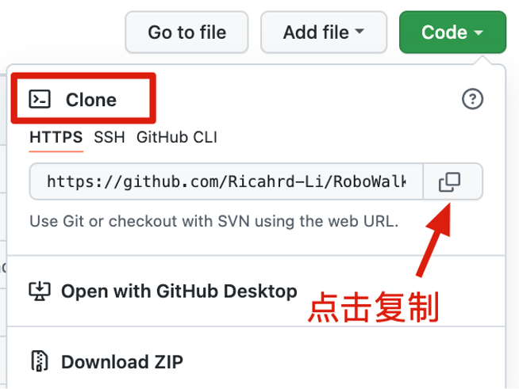

点击``clone``

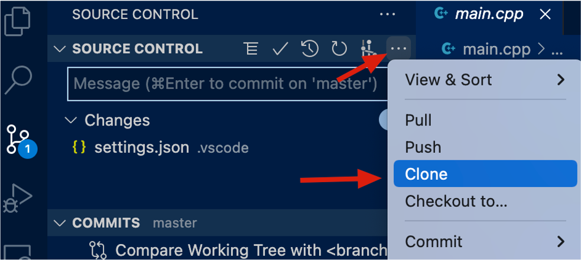

在弹出的文字框中输入Github或Gitee仓库的地址即可。然后按照指示选择clone的位置即可。

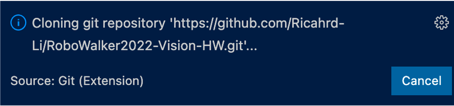

TODO：更新git pull

**推荐的阅读材料**

1. 

### <span id="jump36">3.6 什么是分支</span>

分支是Git中的关键概念。 它可以形象地看成树的枝干。

Git的默认分支是main（老版本是master）

让我们尝试创建一个新的分支。

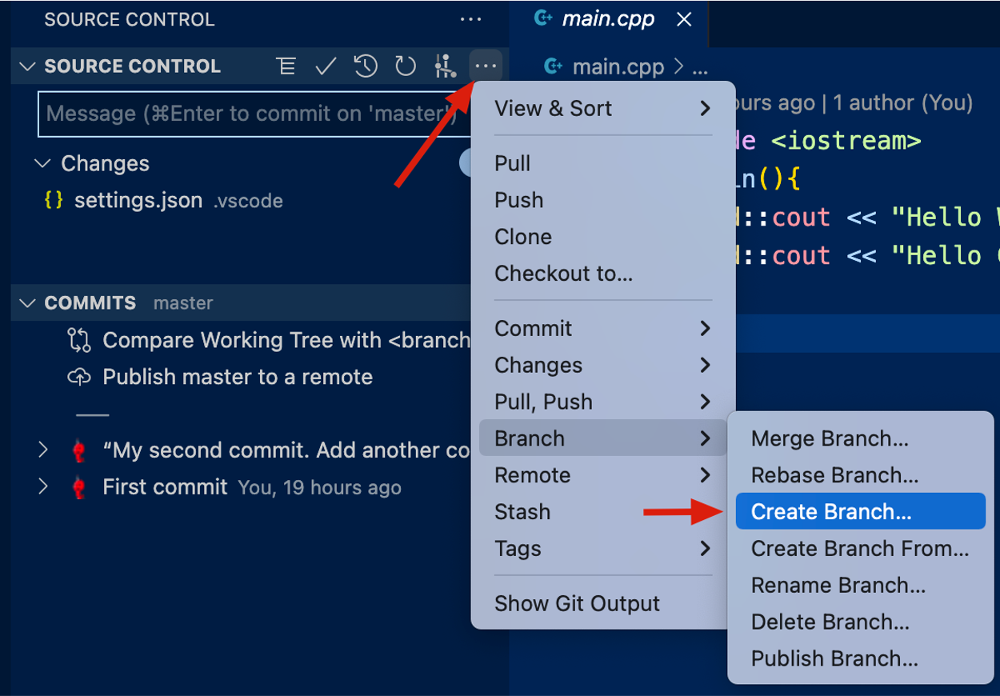

按照弹出的文本框输入新分支的名字，例如``testing``。

按照指示完成后我们就会创建并自动切换到新分支``testing``上。

然后我们点击之前介绍过的checkout按钮，看到如下结果：

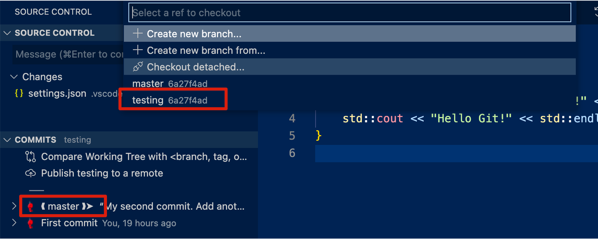

分支的本质是指针。
在创建新分支之前，master指针指向我们最新的提交。

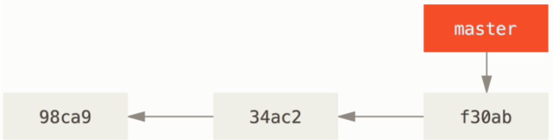

创建新分支后，我们创建的``testing``分支也指向了最新的提交，如下图。

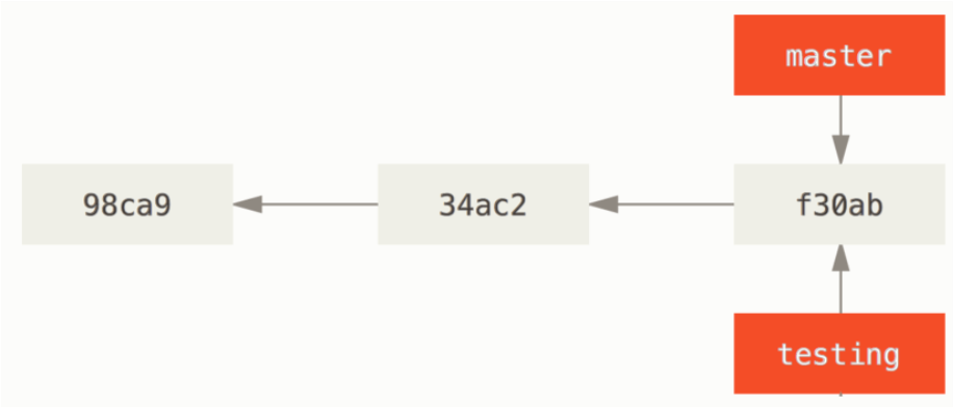

如果我们在testing分支时修改了文件内容并进行一次提交。然后重新切换回master分支再进行新的提交，文件提交历史的结构图如下：

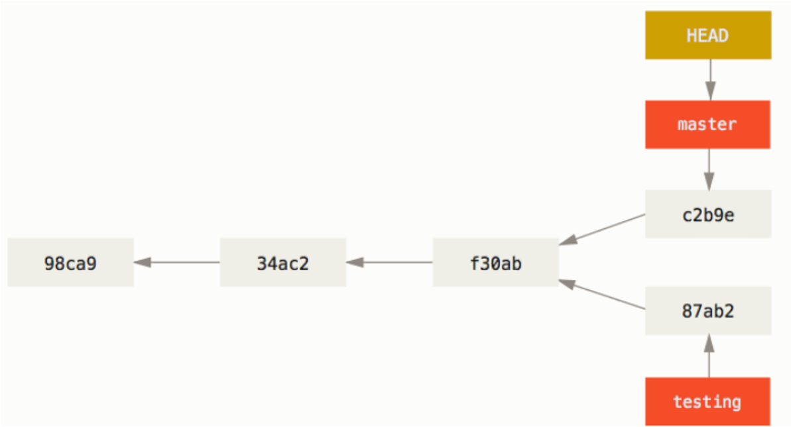

有一个好用的vscode git插件叫做git graph。可以直观地看到Git仓库的提交历史。

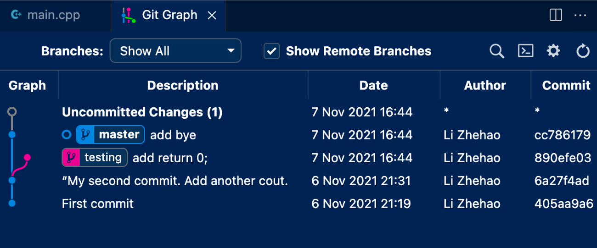

**小练习**

 > 1.你能否跟着上面讲的流程，创建合适的分支和提交，实现和上图Git graph呈现的历史图一样的结果（commit信息不要求一样）？

不同的分支可以用于完成不同的功能。因此分支可以用于多人协作，每个人在自己的分支上工作，最后合并分支。

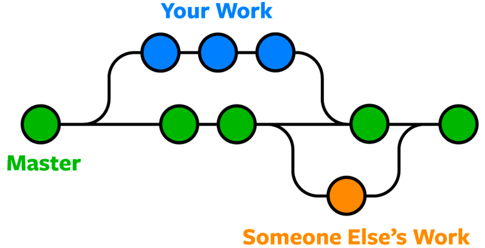

TODO 更新git merge

TODO 更新 git stash

**推荐的阅读材料**
1. （非常好的资源👍最好看一下）[交互式学习Git分支](https://learngitbranching.js.org/
)
2. （非常有用！！！）自行搜索了解Git stash

###  <span id="jump37">3.7 如何合作 & 什么是pull request</span>

一个项目的常见的基于分支的合作方式：

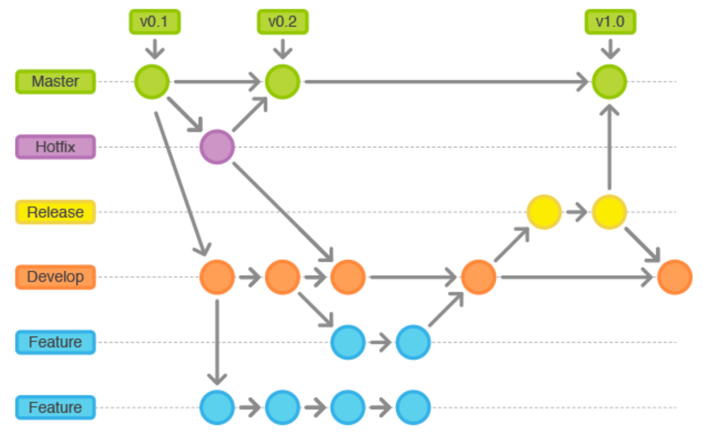

当你发现了作业仓库中的bug后，可以通过pull request的方式贡献你的修复方案！

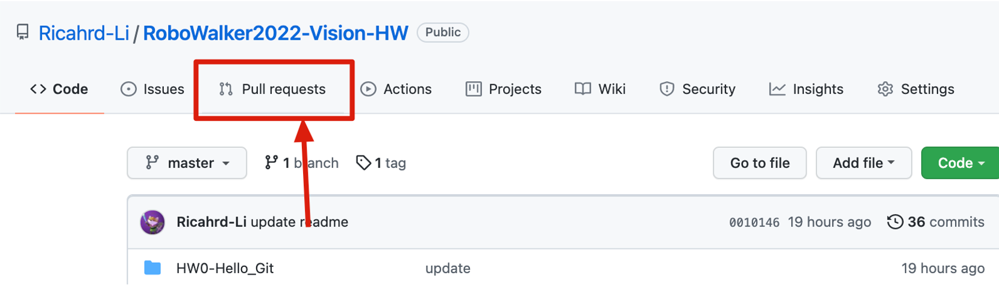

### <span id="jump4">4. 相关学习资源推荐</span>

1. [廖雪峰的中文Git教程](https://www.liaoxuefeng.com/wiki/896043488029600)
2. [Git官方教程](https://git-scm.com/book/zh/v2/)
