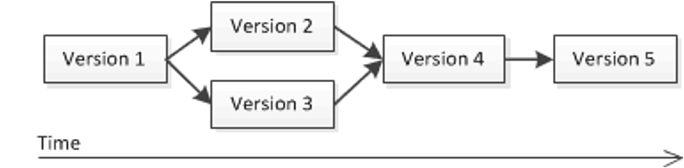

# RoboWalker2022视觉组第0次作业：Git基础
出题人：李喆昊（QQ：1003449832）

Git是世界上使用最为广泛的代码版本控制工具，可以帮助我们提高个人工作以及与他人协作的效率。

## 目标
在本次作业中，你将学习到：

1. [什么是版本控制](#jump1)
   
2. [什么是Git](#jump2)

3. [在实践中学习Git](#jump3) 
   1. [初始化一个Git仓库](#jump31) 
   2. [暂存与提交文件](#jump32) 
   3. [查看状态与日志](#jump33) 
   4. [使用.gitignore忽略不需要的文件](#jump34) 
   5. [从远端代码仓库(Github、Gitee)上拷贝代码](#jump35) 
   6. [什么是分支](#jump36) 
   7. [如何合作 & 什么是pull request](#jump37)
 
4. [相关学习资源推荐](#jump4)

下面让我们开始吧！👇 

### 1. 什么是版本控制

文件的版本，就是在提交/发布使用时，文件内容所处的状态。比如APP的版本。

而当一个文件在提交/发布后仍然可能被多次修改，就会出现多个不同的版本，如下图所示。

如何更有效地管理这些不同的版本，例如发布下一个版本、出现问题时回退到上一个版本、比较不同版本之间的差异、合并两个版本等等，就叫做**版本控制**。

(一个版本之间的关系图)

**推荐的阅读资料：**
1. [Git简介](https://www.liaoxuefeng.com/wiki/896043488029600/896067008724000)
2.  [Git官方文档：起步 - 关于版本控制](https://git-scm.com/book/zh/v2/%E8%B5%B7%E6%AD%A5-%E5%85%B3%E4%BA%8E%E7%89%88%E6%9C%AC%E6%8E%A7%E5%88%B6)

### 2. 什么是Git

Git是目前世界上使用最为广泛的代码版本控制工具。

使用Git可以让我们：
1. 方便地保存工作的关键点，后续出错也能回到之前的状态
2. 方便地分享自己的工作或者合并他人的工作
3. 把代码上传到远端代码仓库，如github.com
4. 比较不同版本的文件，进行调试与问题修复
5. 更多没有列举的好处等待你探索

如何安装Git？请阅读[安装Git](https://www.liaoxuefeng.com/wiki/896043488029600/896067074338496)

**推荐的阅读资料：**
1. [官方教程 Git简史：（关于Linux之父不能继续白嫖别人的版本控制工具于是一气之下自己写了Git这件事-这个标题是我加的）](https://git-scm.com/book/zh/v2/%E8%B5%B7%E6%AD%A5-Git-%E7%AE%80%E5%8F%B2)
2. [官方教程 Git 是什么？](https://git-scm.com/book/zh/v2/%E8%B5%B7%E6%AD%A5-Git-%E6%98%AF%E4%BB%80%E4%B9%88%EF%BC%9F)

### 3. 在实践中学习Git

为了让大家轻松上手Git，我们将使用VSCode在实践中学习Git。Vscode中已经内置了Git功能。

#### 3.1 初始化一个Git仓库

首先，我们需要创建一个Git仓库。

创建完毕后，界面如下：

该文件夹下的Git仓库已经创建好了。

在命令行中，对应的指令是``git init``

####  3.2 暂存与提交文件

####  3.3 查看状态与日志

####  3.4 使用.gitignore忽略不需要的文件

####  3.5 从远端代码仓库(Github、Gitee)上拷贝代码

####  3.6 什么是分支

####  3.7 如何合作 & 什么是pull request

当你发现了作业仓库中的bug后，可以通过pull request的方式贡献你的修复方案！

### 4. 相关学习资源推荐

1. [廖雪峰的中文Git教程](https://www.liaoxuefeng.com/wiki/896043488029600)
2. [Git官方教程](https://git-scm.com/book/zh/v2/)
