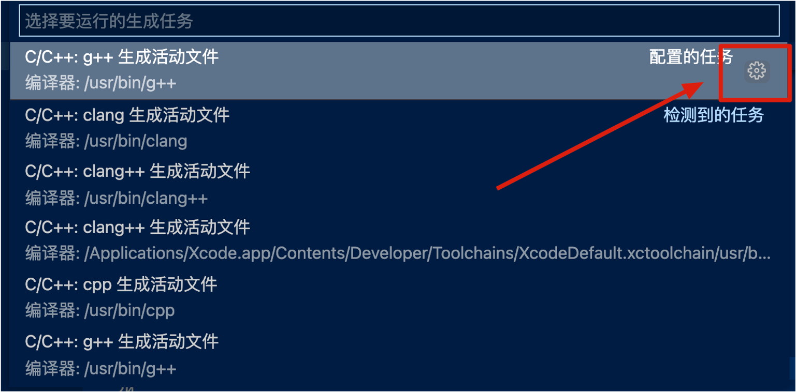

# RoboWalker2022视觉组第0次作业
出题人：李喆昊（QQ：1003449832）

```c++
#include <iostream>
int main(){
    std::cout << "Hello World from C++!" << std::endl; 
}
```
```python
print("Hello World from Python!")
```

## 目标
在本次作业中，你将学习到：

1. <span id="jump1">什么是编译型语言（以C++为例） & 解释型语言（以Python为例）</span>

2. <span id="jump2">如何编译运行你的第一个C++程序：Hello World!</span>

3. <span id="jump3">开始编写你的第一个C++类：Animals</span>

4. <span id="jump4">STL库初体验：使用STL标准库实现一个动物园类</span>

5. <span id="jump5">解释型语言Python初体验</span>

下面让我们开始吧！👇 


### [1. 什么是编译型语言（以C与C++为例） & 解释型语言（以Python为例](#jump1)


计算机底层执行的是01101这样的二进制码（被称为机器语言，Byte Code），但机器语言阅读起来十分困难。

人们之后设计了一种比只包含01的二进制码稍微容易阅读一些的语言——汇编语言（Assembly language），其中的每条指令代表一个机器能执行的操作（如加减、内存地址跳转等）。


(图片来源于网络，[链接](https://www.youtube.com/watch?v=oO8_2JJV0B4))

但由于汇编语言执行的指令非常基础，进行更高层次的开发十分困难，人们又在不断的迭代中开发了更强大且更易于被人类理解的编程语言，被称为高级语言，如C、C++、Java、Python等。

但高级语言最后仍然需要转换为二进制码被机器使用，如下图所示。视转换过程的不同可以将转换的工具分为“编译器”(Compiler)与“解释器”(Interpretor)。


(图片来源于网络，[链接](https://www.tutorialandexample.com/machine-instructions/))


编译器在程序**运行前**扫描完程序的所有内容，将程序转换为可执行文件。在转换过程中由于它已经知道了程序的全貌，它能够及时发现错误告知人类（导致编译失败），并进行一些全局的优化，使得生成的可执行文件效率更优。

解释器在程序**运行时**逐行解释程序，无法提前发现程序中的错误，只有运行到出错的那一行代码时才会报错，也无法进行全局的优化导致运行速度较慢（有一些优化的技术如即时编译(Just-In-Time Compilation)）。但是由于它动态解释的特点，使用起来比较灵活。

C与C++是编译型语言，其运行前需要使用编译器编译代码，而Python是解释型语言。

**相关文章推荐：**

1.  [解释型语言和编译型语言的区别](https://chinese.freecodecamp.org/news/compiled-versus-interpreted-languages/)（[英文原文](https://www.freecodecamp.org/news/compiled-versus-interpreted-languages/)）

<br/>

### [2. 如何编译运行你的第一个C++程序：Hello World!](#jump2)

C++是C语言的升级版，增加了面向对象编程等特性，并提高了计算机资源如内存管理的安全性。

在第一节的介绍中我们知道C++是一个编译型语言，下面我们来看看如何编译运行一个C++程序。

下图展示了一个C++程序的构建流程。

(图片来源于网络，[链接](https://subscription.packtpub.com/book/programming/9781789801491/1/ch01lvl1sec03/the-c-compilation-model))

1. 首先：预处理器(preprocessor)处理``#include``和``#define``等预处理指令，将头文件的内容全部加入源文件，得到一个临时的中间文件。
2. 接着，编译器登场，将中间文件编译为汇编代码。常见的C++编译器有：g++、clang、MingGW（Windows系统上）等。
3. 然后，汇编器（Assembler）将汇编代码转换为二进制机器码（图中的Object code file）。
4. 最后，如果你使用到一些库函数（如``#include<iostream>``），链接器（Linker）登场，将你自己编写的代码转换出的二进制码和你使用到的C++库函数的二进制码打包在一起，得到最终的可执行文件（可执行的、完整的二进制码）。

下面让我们看一个例子。

以使用g++编译器为例，编译文件[``HelloWorld.cpp``](./HelloWorld.cpp)：

#### 方法1. 使用vscode C/C++ 扩展
参考资料：[C/C++ for Visual Studio Code](https://code.visualstudio.com/docs/languages/cpp)

请遵循上面资料中的步骤完成：
1. 安装vscode C/C++ 扩展
2. 安装适合你的平台的编译器（Mac与Linux自带了编译器，Windows可以安装MinGW-x64）
3. 确认编译器已经成功安装

最后，编译运行[``HelloWorld.cpp``](./HelloWorld.cpp)，查看结果。

#### 方法2. 使用命令行 
```
g++ HelloWorld -o run_this 
```
其中`-o`参数后面跟着的是最终生成的可执行文件的名字。然后我们可以执行它，看看结果如何！
```
./run_this
```

**相关文章推荐：**
1. [C++的分步编译](https://hackingcpp.com/cpp/lang/separate_compilation.html)

<br/>

### [3. 开始编写你的第一个C++类：Animals](#jump3)

接下来让我们开始初步了解一下C++的面向对象编程方法。我们使用到的文件有``main.cpp``,``Animals.h``,``Animals.cpp``。

这里，我们声明了一个``Animal``基类，让``Dog, Cat, Sheep, Cow, Fox``类都继承自这个基类。

我们用到的C++类的知识点有：继承、多态、纯虚函数、构造函数成员初始化列表。

请阅读下面的参考资料对这些知识点进行学习。

**参考资料：**

1. [菜鸟教程：c++继承](https://www.runoob.com/cplusplus/cpp-inheritance.html)

2. [菜鸟教程：c++多态、虚函数、纯虚函数](https://www.runoob.com/cplusplus/cpp-polymorphism.html)

3. [菜鸟教程：构造函数成员初始化列表](https://www.runoob.com/w3cnote/cpp-construct-function-initial-list.html)

**运行方法：**
1. g++ 

    ``g++ main.cpp Animals.cpp -o run_this``然后执行``run_this``

2. vscode
    同参考资料[C/C++ for Visual Studio Code](https://code.visualstudio.com/docs/languages/cpp)中的编译步骤，
    但需要注意的是，我们这里有多个cpp文件，需要修改一下配置文件``tasks.json``，点击下图圈出位置：
    
    做如下修改
    ```shell
    "args": [
				"-fdiagnostics-color=always",
				"-g",
				"${file}",
				"../HW0-Hello_World/Animals.cpp", <-- 加入这个文件！
				"-o",
				"${fileDirname}/${fileBasenameNoExtension}"
			],
    ```
    然后，在打开``main.cpp``的界面下，执行vscode的“运行生成任务”，即可得到名为“main”的可执行文件。
    最后执行可执行文件即可。

**目标：** 请运行编译结果，观察结果，并自由修改。

<br/>

### [4. STL库初体验：使用STL标准库中的数组实现一个动物园类](#jump4)

我们使用``std::vector``实现一个动物园类。具体代码请看``zoo.cpp``。

用到的知识点：``std::vector``的初始化与增加元素的``push_back``函数、类的运行时多态。

请阅读下面的参考资料对这些知识点进行学习。

**参考资料：**

1. [C++编译期多态与运行期多态](https://www.cnblogs.com/QG-whz/p/5132745.html)

2. [菜鸟教程 STL vector](https://www.runoob.com/cplusplus/cpp-stl-tutorial.html)

**运行方式：**
1. g++ 

    ``g++ zoo.cpp Animals.cpp -o run_this``然后执行``run_this``

2. vscode
    同第四节。
    配置文件做如下修改
    ```shell
    "args": [
				"-fdiagnostics-color=always",
				"-g",
				"${file}",
				"../HW0-Hello_World/Animals.cpp", <-- 加入这个文件！
				"-o",
				"${fileDirname}/${fileBasenameNoExtension}"
			],
    ```
    然后，在打开``zoo.cpp``的界面下，执行vscode的“运行生成任务”，即可得到名为“zoo”的可执行文件。
    最后执行可执行文件即可。

**目标：** 请运行zoo.cpp，观察结果，并自由修改。

<br/>

### [5. 解释型语言Python初体验](#jump5)

请前往[python官方网站](https://www.python.org/)下载最新版python

请使用Python的可交互命令行环境（被称为REPL（Read–Eval–Print Loop 读取-求值-打印循环））尝试
``print("HelloWorld")``。体验Python作为解释型动态语言相比于C++的不同。 

**目标：**使用Python的REPL环境，打印一句问候语。并可以自由学习下面“相关文章推荐”。

**相关文章推荐：**
1. [菜鸟教程 python3](https://www.runoob.com/python3/python3-tutorial.html)
2. [Python深度学习：Pytorch](https://github.com/pytorch/pytorch)


