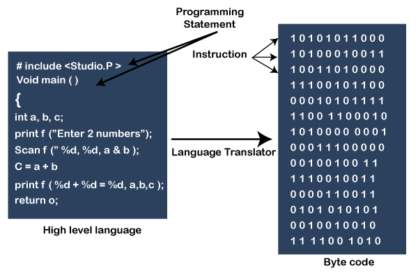
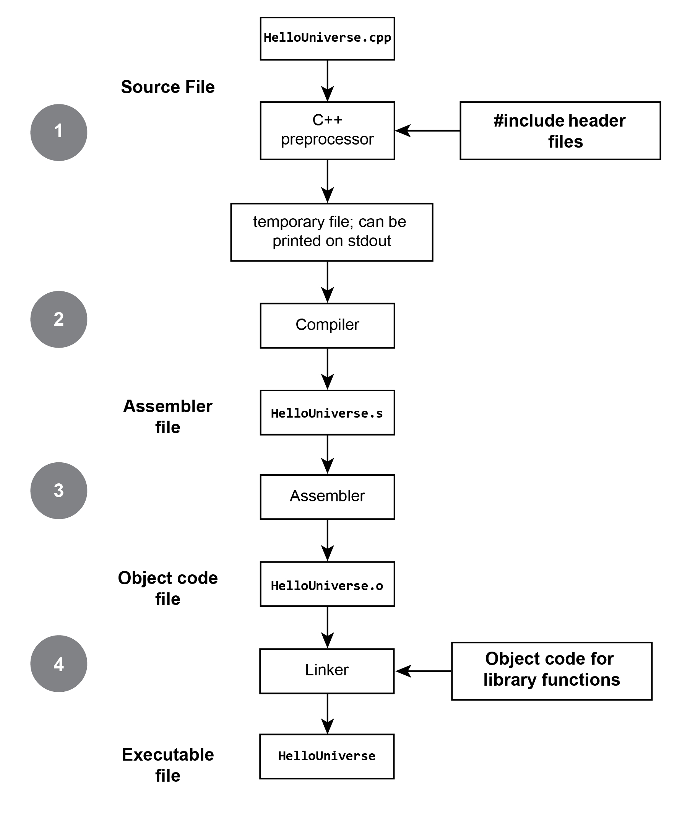

# RoboWalker2022视觉组第0次作业

```c++
#include <iostream>
int main(){
    std::cout << "Hello World from C++!" << std::endl; 
}
```
```python
print("Hello World from Python!")
```

## 目标
在本次作业中，你将学习到：
1. 什么是编译型语言（以C++为例） & 解释型语言（以Python为例）

2. 如何编译运行你的第一个C++程序：Hello World!

3. 开始编写你的第一个C++类：Animals

4. STL库初体验：使用STL标准库实现你的向量和矩阵

5. 解释型语言Python初体验

下面让我们开始吧！👇 

### 1. 什么是编译型语言（以C与C++为例） & 解释型语言（以Python为例）


计算机底层执行的是01101这样的二进制码（被称为机器语言，Byte Code），但机器语言阅读起来十分困难。

人们之后设计了一种比只包含01的二进制码稍微容易阅读一些的语言——汇编语言（Assembly language），其中的每条指令代表一个机器能执行的操作（如加减、内存地址跳转等）。


但由于汇编语言执行的指令非常基础，进行更高层次的开发十分困难，人们又在不断的迭代中开发了更强大且更易于被人类理解的编程语言，被称为高级语言，如C、C++、Java、Python等。

但高级语言最后仍然需要转换为二进制码被机器使用，如下图所示。视转换过程的不同可以将转换的工具分为“编译器”(Compiler)与“解释器”(Interpretor)。




编译器在程序**运行前**扫描完程序的所有内容，将程序转换为可执行文件。在转换过程中由于它已经知道了程序的全貌，它能够及时发现错误告知人类（导致编译失败），并进行一些全局的优化，使得生成的可执行文件效率更优。

解释器在程序**运行时**逐行解释程序，无法提前发现程序中的错误，只有运行到出错的那一行代码时才会报错，也无法进行全局的优化导致运行速度较慢（有一些优化的技术如即时编译(Just-In-Time Compilation)）。但是由于它动态解释的特点，使用起来比较灵活。

C与C++是编译型语言，其运行前需要使用编译器编译代码，而Python是解释型语言。

**相关文章推荐：**

1.  [解释型语言和编译型语言的区别](https://chinese.freecodecamp.org/news/compiled-versus-interpreted-languages/)（[英文原文](https://www.freecodecamp.org/news/compiled-versus-interpreted-languages/)）


### 2. 如何编译运行你的第一个C++程序：Hello World!

C++是C语言的升级版，增加了面向对象编程等特性，并提高了计算机资源如内存管理的安全性。

在第一节的介绍中我们知道C++是一个编译型语言，下面我们来看看如何编译运行一个C++程序。

下图展示了一个C++程序的构建流程。

1. 首先：预处理器(preprocessor)处理``#include``和``#define``等预处理指令，将头文件的内容全部加入源文件，得到一个临时的中间文件。
2. 接着，编译器登场，将中间文件编译为汇编代码。常见的C++编译器有：g++、clang、MingGW（Windows系统上）等。
3. 然后，汇编器（Assembler）将汇编代码转换为二进制机器码（图中的Object code file）。
4. 最后，如果你使用到一些库函数（如``#include<iostream>``），链接器（Linker）登场，将你自己编写的代码转换出的二进制码和你使用到的C++库函数的二进制码打包在一起，得到最终的可执行文件（可执行的、完整的二进制码）。

下面让我们看一个例子。

以使用g++编译器为例，编译文件[``HelloWorld.cpp``](./HelloWorld.cpp)：

#### 方法1. 使用vscode C/C++ 扩展
看这个资料：[C/C++ for Visual Studio Code](https://code.visualstudio.com/docs/languages/cpp)

#### 方法2. 使用命令行 
```
g++ HelloWorld -o run_this 
```
其中`-o`参数后面跟着的是最终生成的可执行文件的名字。然后我们可以执行它，看看结果如何！
```
./run_this
```

**相关文章推荐：**
1. [C++的分步编译](https://hackingcpp.com/cpp/lang/separate_compilation.html)

### 3. 开始编写你的第一个C++类：Animals

接下来让我们开始初步了解一下C++的面向对象编程方法。

### 4. STL库初体验：使用STL标准库实现你的向量和矩阵

TODO

### 5. 解释型语言Python初体验

TODO

## 参考资料

