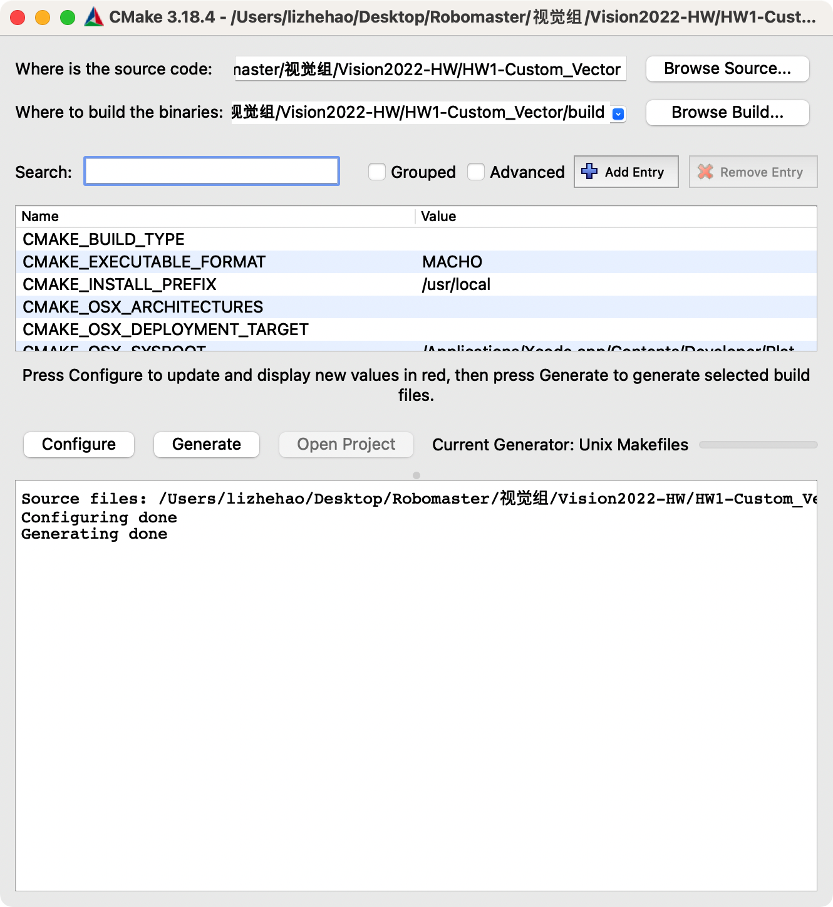

# RoboWalker2022视觉组第1次作业

出题人：李喆昊（QQ：1003449832）


## 目标

实现一个接近STL中``std::vector<float>``功能的自定义向量类``MyVec``（不要求泛型，类型限定为float即可），
不能套壳``std::vector<float>``。

你需要修改的文件是[``src/MyVec.cpp``](./src/MyVec.cpp) （已经包含了一部分示例代码）

要求实现的成员函数（下面所有函数为public，向量的数据为private）为：

### 一. 构造函数部分
1. ``MyVec(int n, const float t)`` 创建一个长度为n的向量，每个元素为t（构造函数）
2. ``MyVec(const MyVec& anotherMyVec)`` 拷贝构造函数

### 二. 插入数据部分
1. ``void push_back(const float x)`` 向末尾增加一个元素x
2. ``int insert(const int idx, const float x)`` 在下标为idx（从0开始）的元素前增加元素x，返回x的下标

### 三. 删除数据部分
1. ``int erase(const int idx)`` 删除下标为idx（从0开始）的函数（注意错误处理）返回后一个元素的下标，如果后一个元素不在向量里，返回-1 

2. ``int erase(const int first, const int last)`` 删除向量中[first,last)中元素，返回后一个元素的下标，如果后一个元素不在向量里，返回-1。first可以=last，last可以等于向量的长度。

3. ``void clear()`` 清空向量中所有元素

    

## 目录结构

```
.
├── CMakeLists.txt
├── README.md
└── src
    ├── MyVec.cpp (你要实现的部分)
    ├── MyVec.h
    └── main.cpp (运行这个主函数)
```


## 提示

1. std::vector采用预先分配内存的方式，通过成员变量``capacity`` 与``size``的关系判断是否需要分配新的内存，作业中采用每次乘以两倍capacity的方式分配新的内存。（见[``MyVec.cpp``](./src/MyVec.cpp)中的``allocateMoreMem``函数）
2. 需要为函数参数含有不合法数据的情况增加额外的判断。当出现异常时，可以使用``throw``关键字抛出异常。
3. 不知道要实现的函数怎么用时，看``main.cpp``中的测试样例。 
4. 有不懂的C++问题时，解决方法

    1. 看教程，如[菜鸟教程](https://www.runoob.com/cplusplus/cpp-tutorial.html)
    2. Google搜索，如看Stack Overflow、相关技术博客
    3. 自己搜索无果后，再询问他人


## 评测方式

1. 运行``main.cpp``，查看输出结果是否正确。


## 编译方式

1. 命令行方式：

    1. 使用g++编译器：在``src``文件夹下执行``g++ MyVec.cpp main.cpp -o hw1 ``，然后运行可执行文件``hw1``

    2. 使用cmake：在``HW1-Custom_Vector``目录下执行

        ```shell
        mkdir build 
        cd build 
        cmake ..
        make 
        ```

        然后执行生成的可执行文件``RoboWalker-Vision2022_HW_1``。

2. 图形界面方式：

    1. 可以使用任意你喜欢的IDE编译

    2. 或者使用cmake-gui，选择源文件目录，在选择生成二进制文件的目录，然后点configure，然后generate。（没用过可以先搜索一下使用方式。）

        


 

## 参考资料
[C++ vector 容器浅析](https://www.runoob.com/w3cnote/cpp-vector-container-analysis.html)

