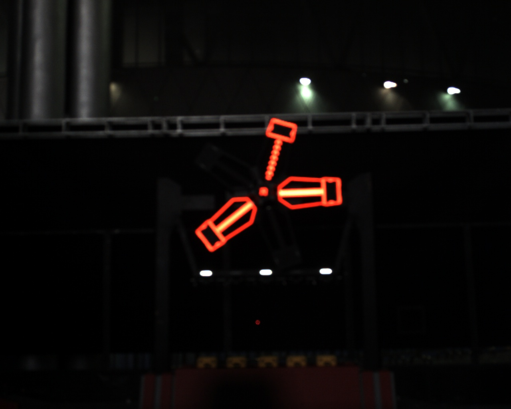
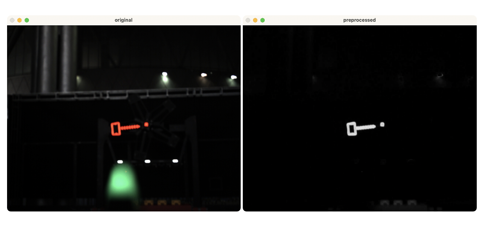
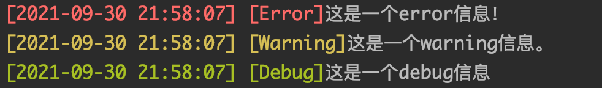

# RoboWalker2022视觉组第2次作业

出题人：李喆昊（QQ：1003449832）


## 目标

使用OpenCV库提供的传统数字图像处理算法，实现一个简化的能量机关识别器，识别出输入图片中未点亮的、需要我们击打的扇叶，感受传统算法的效果与局限性。

你需要修改的C++类有``PowerRuneDetector``与``Preprocessor``。

### 预处理部分

你可能用到的OpenCV函数有：（具体使用用法可以自行查阅文档：[OpenCV 4.5.0 doc](https://docs.opencv.org/4.5.0/)）

1. ``void split(InputArray m, OutputArrayOfArrays mv)`` 用于分离以``Mat``存储的图片的颜色通道
2. ``double threshold(InputArray src, OutputArray dst, double thresh, double maxval, int type) `` 用于对图像像素进行二值化
3. ``void morphologyEx(InputArray src, OutputArray dst, int op, InputArray kernel, Point_<int> anchor = Point(-1, -1), int iterations = 1, int borderType = BORDER_CONSTANT, const Scalar_<double> &borderValue = morphologyDefaultBorderValue())``
    对图像进行形态学处理以去噪

作业中已经写好可以直接使用/参考/加以修改的函数有：

1. `Mat Preprocessor::operator()(const Mat &inputImg) `重载了``Preprocessor``类的``()``运算符，使得在``main``函数中的调用可以简化为：

    ```c++
     auto preprocess = Preprocessor();
     auto midImg = preprocess(img);
    ```

    

### 能量机关扇叶识别部分

你可能用到的OpenCV函数有：

1. ``void findContours(InputArray image, OutputArrayOfArrays contours, OutputArray hierarchy, int mode, int method, Point_<int> offset = Point())``查找图片中的轮廓

作业中已经写好可以直接使用/参考/加以修改的函数有：

1. ``float PowerRuneDetector::getTemplateMatchVal(const Mat& roi, const Mat& templ, Point2f& matchCenter, const int method) `` 对感兴趣区域（ROI：**R**egion **O**f **I**nterest）根据传入的``templ``模板进行匹配，并返回匹配的数值。
2. ``Mat PowerRuneDetector::perspectiveTransform(const RotatedRect& rect, const Mat& inputImg, const bool showResult)``矩形视角变换，将旋转矩形``rect``所在的（可能与坐标轴有夹角的）图像区域提取为平行于坐标轴的（和模板图片方向一致的）矩形图像，用于模板匹配
3. 重载了运算符``()``，原理同``Preprocessor``。


## 代码目录结构

```
.
├── CMakeLists.txt 
├── Detector （PowerRuneDetector类的代码）
│   ├── PowerRuneDetector.cpp
│   └── PowerRuneDetector.h
├── Preprocessor （Preprocessor预处理类的代码）
│   ├── Preprocessor.cpp
│   └── Preprocessor.h
├── README.md
├── Utils （日志输出 & 计时器类的代码）
│   ├── Logger.cpp
│   ├── Logger.h
│   ├── Timer.cpp
│   └── Timer.h
├── data
│   ├── input （输入数据）
│   ├── output （输出目录）
│   └── template （用于OpenCV模板匹配的模板图片）
├── imgs
│   └── ... （README.md中的图片）
├── main.cpp （主函数）
└── test
    └── ... 

```


## 输入/输出

输入数据在``data/input``目录下，有3个文件夹 **（如出现图片无法读取的错误，请修改``main.cpp``中的输入图像以及模板图像的读取路径）**

将识别结果输出到``data/output``目录下，目录结构&文件名和输入数据一致。

示例输入：``data/input/3/1912.jpg``



示例输出：待击打扇叶的识别结果（期望的输出路径为``data/output/3/1912.jpg``）


## OpenCV 环境配置

OpenCV版本使用4.5.0及以上即可。
1. Mac和linux上可以使用包管理器下载相关lib与头文件
2. Windows上：请自行搜索，有好的教程可以提pull request贡献至本文档
3. 有问题可以在视觉组群内讨论

## 提示 & 相关知识

1. 我们的输入数据中能量机关是红色的，可以利用这个信息筛选颜色通道。对于场地中白色光点的滤除，一种常用的方式是：用红色颜色通道减去蓝色颜色通道。

    下图展示了红色通道减去蓝色通道后得到的单通道图片的结果。

    

2. 形态学变换：形态学闭运算可以填充图像中的空洞，形态学开运算可以断开图像中细小的连接（相关的图像处理方式还有顶帽与底帽变换），可以自行搜索并加以使用，提高图像去噪的效果。

3. 展示图片的方法已经写好提供给大家，可以在debug时参考并加以使用。在图片上绘制图形的相关函数有自己写的``drawRotatedRect``、OpenCV提供的``drawContours``等。

4. 我们提供的``Logger`` 类可以在命令行窗口中根据是Error、Warning还是Debug类型输出不同颜色的日志，欢迎调试时使用。

    
